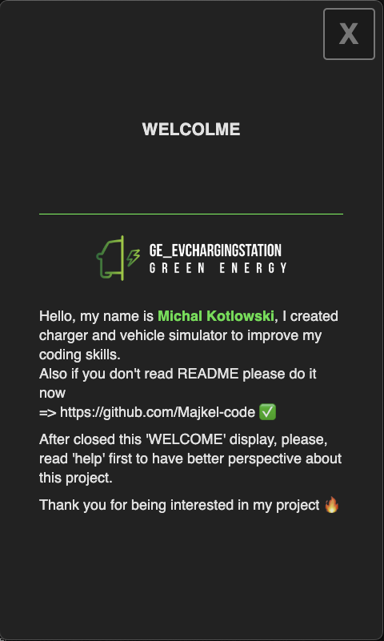

# 🌿 **GE_EvChargingStation**  
### _Green Energy for a Sustainable Future_  


---
## 🛠️ **Tested OS**  

| **OS**    | **CONSOLE**  | **DISPLAY**   | **Standalone App** |
|-----------|--------------|---------------|--------------------| 
| [Windows] |      ✅       |       ✅       |          ❌         |               
| [Linux]   |      ✅       |       ✅       |          ❌         |
| [MacOS]   |      ✅       |       ✅       |          ✅         |


---
# Display Setup

This guide explains how to set up the display for the GE_EvChargingStation project.

---

## 📖 Table of Contents

- [📦 Installation](#-installation)
  - [1️⃣ Console run Setup (Locally)](#1️⃣-console-setup)
  - [2️⃣ RaspberryPi (With display)](#2️⃣-running-the-server-standalone-app)


## 📦 **Installation**

 - ### **Console Setup**

    - ### ⚠️Prerequisites
        - Install [Node.js](https://nodejs.org/).

   - ### 1️⃣ Verify installation:

        ```sh
        node -v
        npm -v
        ```


    - ### 2️⃣ Install Electron:  
        ```sh
        cd GE_EvChargingStation/DISPLAY
        npm install electron --save-dev
        ```  

    - ### 3️⃣ Start the display:  
        ```sh
        npm start main.js
        ```
        

        |✅ Now feel free to use dedicated Electron display app for charger.

 - ### **RaspberryPi Setup**
    # TBD

    ---