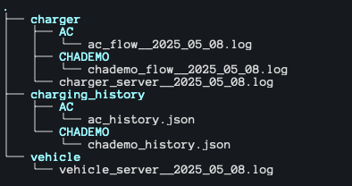
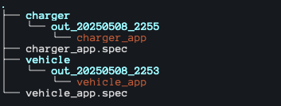

# 🌿 **GE_EvChargingStation**  
### _Green Energy for a Sustainable Future_  


---
## 🛠️ **Tested OS**  

| **OS**    | **CONSOLE**  | **DISPLAY**   | **Standalone App** |
|-----------|--------------|---------------|--------------------| 
| [Windows] |      ✅       |       ✅       |          ❌         |               
| [Linux]   |      ✅       |       ✅       |          ❌         |
| [MacOS]   |      ✅       |       ✅       |          ✅         |


---

## 📖 Table of Contents


- [🚀 Overview](#-overview)
- [✨ Features](#-features)
- [🛠️ Tech Stack](#-tech-stack)
- [📦 Installation](#-installation)
- [▶️ RUN](#-RUN)
  - [1️⃣ Running the Server (from code)](#1️⃣-running-the-server-from-code)
  - [2️⃣ Running the server (Standalone App)](#2️⃣-running-the-server-standalone-app)
  - [3️⃣ Use the Server (Without Display)](#3️⃣-use-the-server-without-display)
  - [4️⃣ Setup Display](#4️⃣-optional-running-the-display)
- [🌐 API Endpoints](#-api-endpoints)
- [📜 License](#-license)
- [💬 Contact](#-contact)


---

## 🚀 **Overview**  
GE_EvChargingStation is a lightweight charger and vehicle simulator designed to help users simulate charging flows, explore connectivity types, and understand the fundamentals of electric vehicle charging.  

> 🌍 _"Electric vehicles are the future of sustainable transportation."_  

---

## ✨ **Features**  

- ⚡ **Run Server**: Start charger and vehicle servers to simulate charging sessions.  
- 🛠️ **Edit Settings**: Customize charger and vehicle configurations.  
- 🔌 **Simulate Charging**: Run charge sessions for one or two outlets simultaneously.  
- 📊 **Real-Time Monitoring**: View logs or use a dedicated display (Electron app supported).  

---

## 🛠️ **Tech Stack**  

| **Technology** | **Description** |  
|-----------------|-----------------|  
| [FastAPI]       | High-performance web framework. |  
| [Python]        | Version 3.11 or higher. |  
| [JavaScript]    | For front-end and Electron integration. |  
| [Electron]      | Desktop app for real-time monitoring. |  

---

## 📦 **Installation**  

1. **Prerequisites**:  
   Ensure [Python](https://www.python.org/) v3.11+ is installed.  

2. **Clone the Repository**:  
   ```sh
   git clone <repository-url>
   cd GE_EvChargingStation
   ```

3. **Install Dependencies**:  
   ```sh
   pip3 install -r ./requirements.txt
   ```

---

## ▶️ **RUN**  

### 1️⃣ **Running the Server (from Code)**  

Open two terminal tabs and execute the following commands:  

**First Tab**:  
```sh
cd GE_EvChargingStation
python3 CHARGER/charger_server.py
```  

**Second Tab**:  
```sh
cd GE_EvChargingStation
python3 VEHICLE/vehicle_server.py
```  
It should create also directories where you will find log files



📝 NOTE - *_history.json files will create when first connection CHARGER ↔ VEHICLE will up

### 2️⃣ **Running the server (Standalone App)**
```sh
cd GE_EvChargingStation/BUILDER
```
Here you should see structure as below.


- Structure begins of component - then out_(date of build)
- ⚠️ If you want to make another build just perform
  ```sh 
  .venv/bin/pyinstaller BUILDER/[component].spec
  ```
  after some time it should create directory with actual date of build and application inside
   - ⚠️ Old build will not be deleted automatically!

From here just run these apps
- Logs and Authorization directory will create in your current directory

### 3️⃣ **Use the Server (Without Display)**
  In a third terminal tab, send a `curl` request or use [Postman](https://www.postman.com/):  
  ```sh
  curl http://127.0.0.1:5000/is_alive
  ```  
  ⚠️ Some of the endpoints needs AUTHORIZATION_KEY (host_key.txt) Charger will create it in first run
  - You can paste 📋 it to ${GLOBAL_AUTH_KEY} in [./tests/ROBOT_TESTS/testdata/variables/globals.resource](./tests/ROBOT_TESTS/testdata/variables/globals.resource) to perform automation tests
  - Use it as authorization header via Postman
  - Send curls via terminal

  Collection of requests can be find in [./postman_collection](./postman_collection/)

### 4️⃣ **Optional: Running the Display**  

- To open setup for display please follow this link -> [CLICK HERE](./DISPLAY/README.md) 

---

## 📜 **License**  

MIT License.  
**Free Software, Hell Yeah!**  

---

## 💬 **Contact**  

For questions or feedback, feel free to reach out:   
🌐 GitHub: [Majkel-code](https://github.com/Majkel-code)  

---
